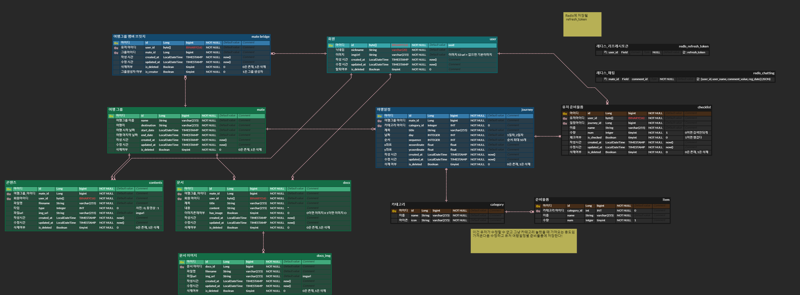

# A204 - 자율 프로젝트

<!-- 필수 항목 -->

## 카테고리

| Application                          | Domain                                | Language                         | Framework                                  |
| ------------------------------------ | ------------------------------------- | -------------------------------- | ------------------------------------------ |
| :black_square_button: Desktop Web    | :black_square_button: AI              | :black_square_button: JavaScript | :black_square_button: Vue.js               |
| :black_square_button: Mobile Web     | :black_square_button: Big Data        | :black_square_button: TypeScript | :black_square_button: React                |
| :black_square_button: Responsive Web | :black_square_button: Blockchain      | :black_square_button: C/C++      | :black_square_button: Angular              |
| :white_check_mark: Android App       | :black_square_button: IoT             | :black_square_button: C#         | :black_square_button: Node.js              |
| :black_square_button: iOS App        | :black_square_button: AR/VR/Metaverse | :black_square_button: Python     | :black_square_button: Flask/Django/FastAPI |
| :black_square_button: Desktop App    | :black_square_button: Game            | :white_check_mark: Java          | :white_check_mark: Spring/Springboot       |
|                                      |                                       | :white_check_mark: Kotlin        |                                            |

<!-- 필수 항목 -->

## 프로젝트 소개

- 프로젝트명: **JourneyMate**
- 서비스 특징: 편리한 여행 준비를 위해 여행 준비물 추천 및 체크리스트를 기반으로 여행자들의 걱정을 덜을 수 있는 서비스
- 주요 기능
  - 여행 준비물 목록 체크리스트
  - 여행 그룹 관리 (여행 콘텐츠, 여행 문서 관리)
  - 여행 일정 관리
  - 여행 그룹 채팅방
- 주요 기술
  - Spring Cloud를 이용한 MSA
  - Kotlin Android Studio
  - STOMP를 이용한 실시간 채팅
- 참조 리소스
  - JPA: 객체와 데이터베이스의 관계를 매핑
  - Android Studio: 안드로이드 어플리케이션 개발
- 배포 환경
  <!-- 웹 서비스, 랜딩 페이지, 프로젝트 소개 등의 배포 URL 기입 -->
  - URL: [구글 드라이브 url]
  <!-- 로그인이 필요한 경우, 사용 가능한 테스트 계정(ID/PW) 기입 -->
  - 테스트 계정: 카카오 로그인만 가능하여 X

-아키텍처

<!-- 자유 양식 -->

## 프로젝트 UI/기능

- 로그인 후 자신의 일정 관리 접속(Mate-service)   
  

- 여행 그룹 생성(Mate-service)  
  

- 여행 그룹 문서 관리(Mate-service)  

- 여행 그룹 사진 관리(Mate-service)  
    

- 여행 그룹 내 채팅 서비스(Chat-service)  

- 여행 일정 등록 및 관리, GoogleMap 사용(Journey-service)  
  

## 팀 소개

- 김도현: 팀장, 풀스택 개발
- 이두현: 풀스택 개발
- 박민혁: 인프라, 백엔드 개발
- 최주호: 풀스택 개발
- 김민식: 풀스택 개발

<table>
  <tr>
    <td align="center" width="500px">
      
    </td>
    <td align="center" width="500px">
      
    </td>
    <td align="center" width="500px">
      
    </td>
  </tr>
  <tr>
    <td align="center">
      <a href="https://github.com/Noopy94" target="_blank">
        이두현 (Full-stack)
      </a>
    </td>
    <td align="center">
      <a href="https://github.com/jvlover" target="_blank">
        박민혁 (Infra)
      </a>
    </td>
    <td align="center">
      <a href="https://github.com/mongsuokki" target="_blank">
        최주호 (Full-stack)
      </a>
    </td>
  </tr>
  <tr>
    <td align="center" width="500px">
      
    </td>
    <td align="center" width="500px">
      
    </td>
  </tr>
  <tr>
    <td align="center">
      <a href="https://github.com/fnejd" target="_blank">
        김도현 (Full-stack)
      </a>
    </td>
    <td align="center">
      <a href="https://github.com/">
        김민범 (Full-stack)
      </a>
    </td>
  </tr>
</table>

<!-- 자유 양식 -->

## 프로젝트 상세 설명

### 개발 환경

| 분야         | 항목        | 버전   |
| ------------ | ----------- | ------ |
| 백엔드       | Java        | 17     |
| 백엔드       | Spring boot | 2.7.17 |
| 안드로이드   | Android SDK | 33     |
| 데이터베이스 | MariaDB     | 11.1.2 |
| 데이터베이스 | Redis       | 7.2.2  |
| 데이터베이스 | MongoDB     | 7.0.2  |

### ERD

